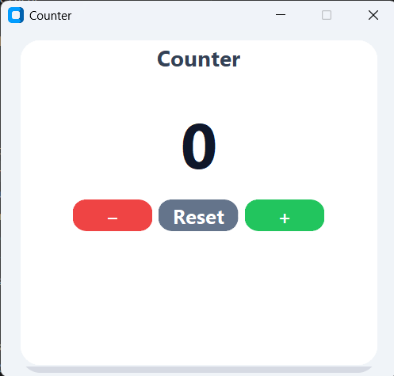
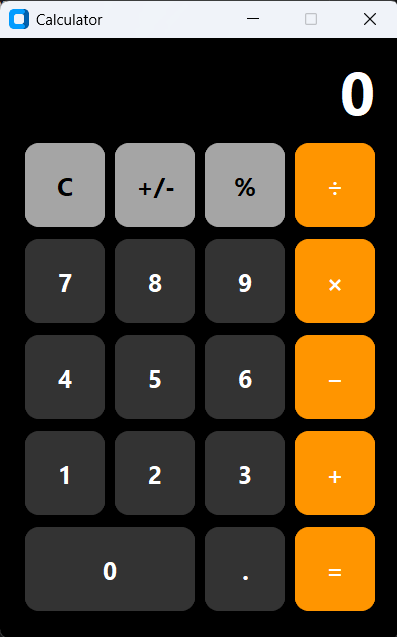
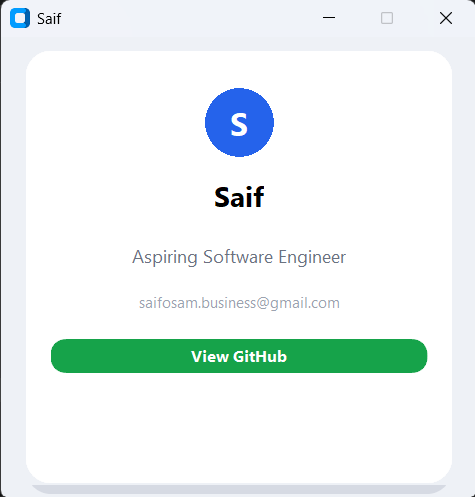
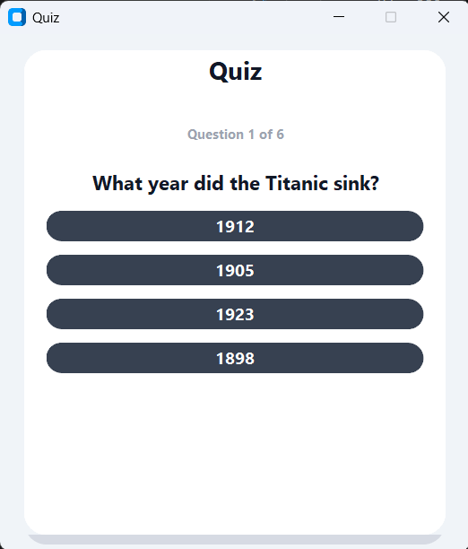
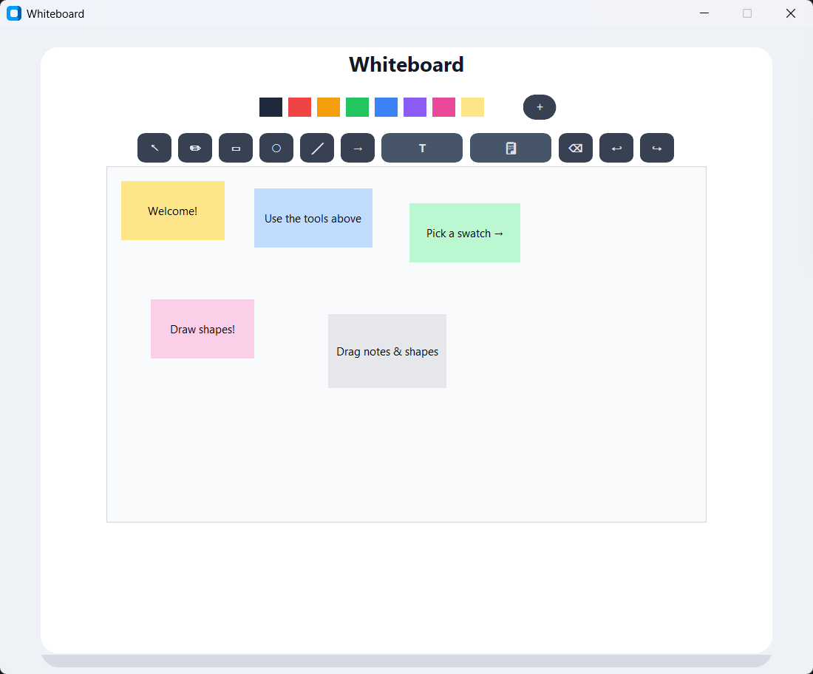

# Vex Programming Language

Vex is a tiny Python-based DSL for building styled desktop apps using `customtkinter`.
A `.vex` file is divided into three top-level zones: `style:`, `logic:`, and `view:`.

## Why Vex exists

Vex keeps styling, application logic, and UI structure separate while reusing Python for
actual code. That means:

- `logic:` can contain real Python, including imports, functions, globals, and expressions.
- `style:` defines reusable visual defaults in a simple selector block syntax.
- `view:` declares the UI with Python-like call syntax and nested indentation.

Each `.vex` file is split into three zones:

```vex
style:
    [styling rules]

logic:
    [Python code]

view:
    [UI structure]
```

## Getting started

### 1. Install dependencies

```bash
pip install customtkinter pillow
```

### 2. Run an example app

```bash
python src/cli.py examples/calculator.vex
```

A calculator window will open. Close it and try some of the other examples in the `examples/` folder.

### 3. Create your own Vex app

Create a file called `hello.vex` with three zones:

```vex
style:
    window:
        title: Hello
        width: 360
        height: 240
    button:
        background: "#2563eb"
        color: white
        font_size: 15

logic:
    message = ""

    def greet():
        global message
        message = "Hello, Vex!"

view:
    card():
        text("My First App", role="title")
        display(bind="message", font_size=18, color="#16a34a", align="center")
        button("Click me", onclick=greet)
```

Run it:

```bash
python src/cli.py hello.vex
```

You'll see a card with a title, a display area, and a button. Click the button — the display updates with "Hello, Vex!"

### Understanding the three zones

- **`style:`** — defines colours, sizes, and layout for each UI element type.
- **`logic:`** — plain Python. Variables here can be shown in the UI via ``display(bind="varname")`` and functions can be called from ``button(onclick=fn)``.
- **`view:`** — the UI tree. Containers like ``card()`` and ``row()`` hold other elements; leaf nodes like ``text()``, ``button()``, and ``display()`` create actual widgets.

### Key concepts

- **Bound displays** — ``display(bind="count")`` shows the live value of a Python variable. The display updates whenever your button handlers call ``global count``.
- **Global keyword** — always use ``global varname`` inside functions that modify a variable you want reflected in the UI.
- **Layout helpers** — use ``row()`` for horizontal arrangement, ``column()`` for vertical, and ``grid(cols=4, rows=5)`` for calculator-style grids.


## Zones

### `style:`

Defines style selectors and key/value pairs.

Example:

    style:
        window:
            title: My App
            width: 380
            height: 480
        button:
            background: "#2563eb"
            color: white
            font_size: 13

### `logic:`

Contains ordinary Python code. `logic:` is executed directly with Python's own interpreter,
so any valid Python is valid here.

Example:

    logic:
        count = 0

        def increment():
            global count
            count += 1

### `view:`

Declares the UI tree using function-call syntax. Containers end with `:` and children are
indented beneath them.

Text tags can be styled inline at the time they are declared using `role`, `color`, `font_size`,
and other styling kwargs. For example: `text("Saif", role="title", color="black", font_size=22)`.

Example:

    view:
        card(shadow="true"):
            text("Hello", role="title", color="#111827", font_size=22)
            button("Click me", onclick=increment)

## Supported tags

The current implementation supports these built-in tags:

- `card(...)` — styled panel with optional `background`, `corner_radius`, `shadow`
- `row()` / `column()` — horizontal / vertical layout containers
- `grid(cols=..., rows=...)` — grid layout container with row/col placement
- `canvas(width=..., height=..., background=...)` — freeform workspace for absolute placement
- `text("...", role=..., color=..., font_size=...)` — text label
- `button("...", onclick=..., background=..., color=..., font_size=..., row=..., col=..., span=...)`
- `display(bind="varname", font_size=..., color=..., align=...)` — bound value display
- `avatar(source="Name", background=..., color=..., size=...)` — initials badge
- `note("...", x=..., y=..., width=..., height=..., color=...)` — draggable canvas note
- `palette(colors="#hex,#hex,...")` — clickable swatches for recoloring selected notes
- `tool("Label", action="add_note"|"add_image")` — canvas action button

Any unrecognized tag name is also treated as a `customtkinter` widget by mapping the tag
name to `CTk<TagName>` (for example, `entry(...)` becomes `CTkEntry(...)`).

## Example

    style:
        window:
            title: Counter
            width: 380
            height: 380

    logic:
        count = 0

        def increment():
            global count
            count += 1

    view:
        card(shadow="true"):
            text("Counter", role="title")
            button("Increment", onclick=increment)
            display(bind="count", align="center")

## Project layout

- `src/cli.py` — app entrypoint that splits zones, executes `logic:`, parses `style:` and `view:`, and launches the GUI
- `src/zones.py` — extracts `style:`, `logic:`, and `view:` sections from a `.vex` file
- `src/style_parser.py` — parses style selectors into simple dictionaries
- `src/view_parser.py` — parses the nested view DSL into a tree structure
- `src/codegen.py` — renders the UI tree into `customtkinter` widgets
- `src/errors.py` — user-facing parse/runtime error reporting
- `examples/` — sample `.vex` applications
- `docs/` — language specification and design notes
- `tests/` — unit tests for parser behavior

## Documentation

For detailed language specifications and design rationale, see:

- [docs/language-spec.md](docs/language-spec.md) — complete zone syntax, built-in tags, and grammar reference
- [docs/DESIGN.md](docs/DESIGN.md) — architectural decisions and why Vex is structured as it is

---

### Example apps

All examples live in the `examples/` folder. Run any of them from the repo root with:

    python src/cli.py examples/<filename>.vex

Or with the included virtual environment on Windows:

    .venv\Scripts\python.exe src/cli.py examples/<filename>.vex

---

#### Counter

A minimal counter with increment, decrement, and reset buttons. Demonstrates `display(bind=...)` for live value tracking, `row()` layout, and inline button styling with hover states.

```bash
python src/cli.py examples/counter.vex
```



---

#### Calculator

A fully functional iPhone-style calculator supporting `+`, `−`, `×`, `÷`, `%`, sign toggle, and decimal input. Showcases `grid(cols=4, rows=5)` layout with span support.

```bash
python src/cli.py examples/calculator.vex
```



---

#### Business Card

A digital business card with avatar initials badge, title/subtitle/caption text, and a clickable button that opens a GitHub profile in the browser. Demonstrates `avatar()`, inline text roles, and the `webbrowser` module from Python's standard library.

```bash
python src/cli.py examples/business_card.vex
```



---

#### Quiz

A trivia quiz game with 6 shuffled questions, score tracking, answer feedback (correct/incorrect), answer locking to prevent double-clicks, and a play-again loop. Demonstrates complex `logic:` workflows with lists, random shuffle, and bound button text.

```bash
python src/cli.py examples/quiz.vex
```



---

#### Whiteboard

An Excalidraw-style drawing canvas with 9 tools: select, freehand pencil, rectangle, oval, line, arrow, text notes, eraser, plus undo/redo. Features a color palette swatch for recoloring shapes and draggable sticky notes on the canvas.

```bash
python src/cli.py examples/mood_board.vex
```



## Dependencies

- `customtkinter`
- `Pillow`

Install dependencies with:

    pip install customtkinter pillow

## Known limitations

- There is no automatic reactive state system. UI updates happen when event handlers
  trigger the refresh function, not automatically when Python variables change.
- The `style:` parser is intentionally simple: it only supports a flat selector block
  structure with `key: value` pairs.
- This project targets desktop GUI apps only via `customtkinter`.

## Notes

- `logic:` is executed as regular Python, so use `global` to update module-level variables
  if you want bound displays and buttons to reflect changed values.
- `view:` indentation matters; maintain consistent spaces for nested containers.

## Publishing

This project uses `vex-lang` as the distribution name while providing a top-level
import alias so users can `import vex` after installing. Install the package with:

```bash
python -m pip install vex-lang
```

For full publish instructions (building, testing, uploading to TestPyPI/PyPI, and CI details),
see the publishing guide: [docs/PUBLISHING.md](docs/PUBLISHING.md).

Quick local publish commands:

```bash
python -m pip install --upgrade build twine
python -m build
python -m twine check dist/*
python -m twine upload dist/*
```

## Desktop installer

To create a standalone Windows executable, use PyInstaller:

```powershell
python -m pip install --upgrade pyinstaller
scripts\build_installer.bat
```

If `assets\vex.ico` is present, the build script will embed it into `dist\vex.exe`.

This generates `dist\vex.exe`, which can be run against `.vex` files directly.
For a full installer package, wrap `dist\vex.exe` with Inno Setup or NSIS.

To make `.vex` files show the Vex icon globally in Windows Explorer, run:

```powershell
powershell -ExecutionPolicy Bypass -File .\scripts\register_vex_file_assoc.ps1
```

That registers the `.vex` extension with the icon from `assets\vex.ico` for the current user. Restart Explorer or sign out/in to refresh the icon cache.

Read more in [docs/INSTALLER.md](docs/INSTALLER.md).
